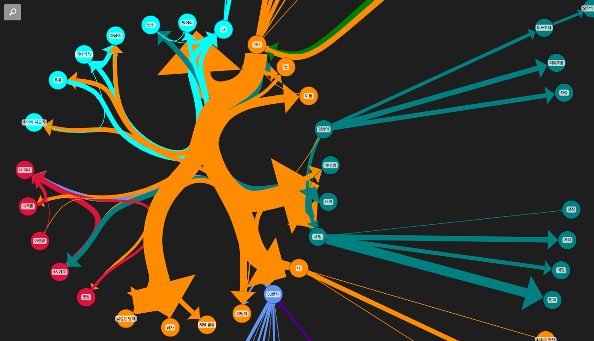

# GraphRAG playground

## Get started

1. 환경설정

```sh
mv .env.sample .env
```

2. 패키지설치

```sh
pip install -r requirement
```

3. GraphRAG프로젝트 생성

    * 초기화
    ```sh
    graphrag init --root ./ragtest
    ```

4. `settings.yaml` 설정
    * Azure용 설정파일 복사
        ```sh
        cp .env ./ragtest
        cp settings.yaml ./ragtest
        ```
    * 클레임 추출 enable 확인
        ```yaml
            claim_extraction:
                enabled: false
        ```    

5. 인덱싱 데이터 준비 및 인덱싱

    ```sh
    mkdir -p ragtest/input && cp data/wing.txt ragtest/input

    graphrag index --root ./ragtest
    ```

6. Knowledge 그래프 시각화

    
    [노트북 - graphrag-visualization](./graph-visualization.ipynb)

7. Query 실행

    [노트북 - graphrag_index_query](./graphrag_index_query.ipynb)
    * Local Query
    * Global Query
    * [DRIFT Query](https://microsoft.github.io/graphrag/query/drift_search/)


## Neo4j Cypher쿼리 생성 예제

[graphrag_neo4j](./graphrag_index_query.ipynb)

## Reference

* GraphRAG PodCast Demo: https://unified-copilot.azurewebsites.net/
* Graph Builder: 
https://neo4j.com/developer-blog/graphrag-llm-knowledge-graph-builder/
https://llm-graph-builder.neo4jlabs.com/
https://neo4j.com/blog/graphrag-manifesto/

* GraphRAG Accelerator